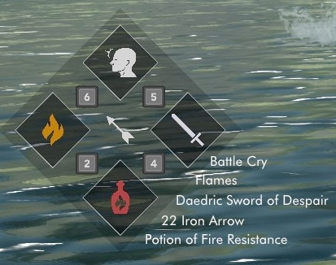

# Soulsy

Soulsy is a minimal-features Souls-style hotkey HUD for Skyrim SE and AE. It is inspired by hotkey mods like Elden Equip, iEquip, and LamasTinyHud. It is in fact a fork of [LamasTinyHud](https://github.com/mlthelama/LamasTinyHUD)! It is simpler than LamasTinyHud is, however.

Check out the remarkably terse [user docs](./docs/usage.md). Or take a peek at a [short video of the HUD in action](https://youtu.be/rys9QjC9eak).

## Development goals

My goals are two-fold: make a Souls-style equip HUD that is exactly what I want to use, and learn how to do Rust FFI. A bonus is demonstrating how to write Skyrim native-code mods in Rust.

This project is almost ready to release. There are a couple of bugs I'd like to fix. My eventual goal is to move everything except the SKSE plugin glue code to Rust, and have the C++ mostly vanish. See the TODO list at the end of this readme for details about my next steps.

## Building

Soulsy is a Rust and C++ project, using CMake to drive Cargo to build the Rust parts. The application logic is implemented in Rust, with a bridge to the C++ libraries required to implement an SKSE plugin. It requires the following to build:

- [Rust](https://rustup.rs) set up for Windows (not for WSL)
- [Visual Studio 2022](https://visualstudio.microsoft.com) with C++ compilers installed
- [CMake](https://cmake.org)
- [vcpkg](https://github.com/microsoft/vcpkg) with `VCPKG_ROOT` set in a user environment variable

The plugin requires the following vcpkg libraries, which will be installed for you:

- [CommonLibSSE-NG](https://github.com/CharmedBaryon/CommonLibSSE-NG)
- [spdlog](https://github.com/gabime/spdlog)
- [simpleini](https://github.com/brofield/simpleini)
- [nanosvg](https://github.com/memononen/nanosvg)
- [imgui](https://github.com/ocornut/imgui)

There are a number of development conveniences in the [justfile](https://just.systems), including build and archive recipes for Powershell. `cargo install just` if you do not have it. Because I am more comfortable on Unixes than on Windows, some recipes are written in Bash.

`cargo --doc open` displays programmer documentation for the Rust side of the plugin. The C++ side is commented, but not to the same degree.

You are absolutely invited to contribute. This project follows the standard [Contributor's Covenant](./CODE_OF_CONDUCT.md).

## Credits

I could not have approached the rendering code without the work in [LamasTinyHud](https://www.nexusmods.com/skyrimspecialedition/mods/82545), so [mlthelama](https://github.com/mlthelama) gets all the props. I also learned a lot about how to make an SKSE plugin by reading their source. Give that HUD a try if you don't like the souls-game style, or want a UI you can edit in-game. The original has more features than this one does! It's also the only hotkeys hud mod I tried that worked well in my game, so that's a testimonial.

The icons for the built-in theme are the usual SkyUI icons, plus the `futura-book-bt` true-type font. The other layout data is adapted from the [Untarnished UI skin](https://www.nexusmods.com/skyrimspecialedition/mods/82545) for LamasTinyHUD by [MinhazMurks](https://www.nexusmods.com/skyrimspecialedition/users/26341279).

[cxx](https://cxx.rs/) made developing the C++/Rust bridge a snap. This crate unlocks Rust as a viable language for all of your modding needs. The only drawback is that async Rust is not yet supported, but there are workarounds described in the docs.

## TODO

Remaining before I release:

- [ ] I18n: fonts. ??
- [ ] Is there an official way to show a textual feedback message in SkyUI?
- [ ] Make a *good-looking* layout. Find a designer if necessary.
- [x] Review the 20-or-so TODO items noted in code comments.
- [ ] User docs, for the readme and for the Nexus page.
- [ ] Hammer the hell out of it while playing. Fix whatever doesn't stand up to abuse.
- [ ] Consider getting more testers.

Second phase goals:

- [ ] Move image loading code to Rust. This will bring in the [windows](https://lib.rs/crates/windows) crate ecosystem.
- [ ] Move imgui rendering to Rust. Bindings exist already, plus a DX11 rendering back end.
- [ ] Make image loading on-demand, to save memory. (Maybe an unimportant optimization? Measure.)
- [ ] Add support for debug builds to CMake, or at least remove the half-done option.
- [ ] Decide what to do about highlight animations.
- [ ] Track highlight status in the controller to support animating a highlighted slot.

DONE:

- [x] Figure out how to compile papyrus scripts. Answer: Pyro.
- [x] Edit the `.esp`` if necessary. Check it in.
- [x] Rewrite or merely just tweak the script that builds the mod archive itself, with correctly-placed files.
- [x] Test to see if the mod loads at all into the game. Fix whatever's broken.
- [x] Finish up the icon data loading function.
- [x] Hack out the per-page position settings stuff to ask Rust for info for exactly four slots, the ones visible right now.
- [x] Handle the case of equipped items not being in the cycle, while the cycle is being advanced.
- [x] Wire up the equip-item functions as well as the equip delay. Implement a timer using the tick in the imgui rendering code.
- [x] Implement a get-current-slot-info function that handles the case where the current item is not in a cycle.
- [x] Debounce keys. Especially the show/hide button.
- [x] Wire up the mod to MCM to show its config & write user settings.
- [x] Figure out what I'm doing wrong with MCM config settings. No really.
- [x] Figure out what I'm doing wrong with translation files. UTF-16 LE, one tab. What else? **CRLF**.
- [x] Why is consuming potions unstable? Sometimes fine, sometimes lockup.
- [x] Make re-equipping the left-hand item work.
- [x] Wire up the inventory-changed hooks.
- [x] Inform Rust about equip changes.
- [x] Get ammo showing correctly.
- [x] Validate cycle data on save load. Baking the data into the save might be more robust long-term, but I don't know how to do that yet.
- [x] Wire up activating the utility button.
- [x] Figure out why activating potions makes the game lock up.
- [x] Get all layout info into one file; load it into the shared struct. (Is shared the right choice? who knows.)
- [x] Come up with an adequate default layout for the HUD.
- [x] I18n: translation files.
- [x] Code cleanup. DRY up the C++. Reorganize the Rust. Tighten up names.
- [x] Cycle serialization files should include the player name so character-hopping doesn't lose dta.
- [x] Sort out `gear.h` vs `utility_items.h`. Merge?
- [x] Improve the CMake files so rebuilding is reliable.
- [x] Make Rust log to a second file in the same directory as SKSE.
- [x] Add more Rust debug-level logging for happy-path cases.

## License

GPL-3.0.
