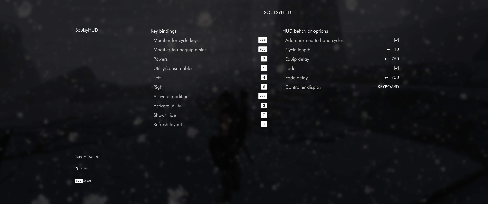

# Using SoulsyHUD

Soulsy lets you set hotkeys for managing what you have equipped or readied in four equipment slots:

- right hand: weapons, spells, two-handed weapons, scrolls
- left hand: one-handed weapons, spells, shields, torches, lanterns
- shouts and minor powers, scrolls
- a utility slot: potions, poisons, food, armor

Soulsy sets up _cycles_ for each of these equipment slots. For example, if you want to switch between Flames and Healing spells in your left hand, you'd add each of them to your left hand cycle. For your right hand, you might set up a long sword with an anti-undead enchantment, a dagger with Soul Trap, and a bow. Pressing the key assigned to a slot moves to the next item in your cycle and equips it (or readies it, in the case of the utility slot). If you tap the key several times quickly, you'll advance through the cycle and then equip the item you were on when you stopped tapping the button.

The maximum cycle length is configurable, but caps out at 20. 20 items is a lot of items to cycle through this way, and if you have that many you'd probably be better off using the inventory or favorites menu.

To add or remove an item from a cycle, bring up the inventory, magic or favorites menu, hover over the item, and press the hotkey for the cycle you want to add it to. If the item is not in the cycle for that slot and it's appropriate for the slot, it'll be added. If it's already in that cycle, it'll be removed. Soulsy prints text feedback on the screen about what it did.

Soulsy also has a hotkey for activating your selected utility item. This is the only category of item that Soulsy will try to activate for you; everything else needs to used the same way the base game has you use them. The last hotkey-able shortcut is for hiding and showing the HUD.

That's it for the feature set. Soulsy does not (yet?) attempt to select the best ammo, potion or poison the way iEquip does. It equips what you tell it to equip, as quickly and reliably as it can. Soulsy also does not offer in-game layout editing, though you can modify the layout by editing a toml file outside the game. There's a refresh key that you can set and use to reload on the fly to
look at your changes.

## Available keybinds



The MCM allows you to set keybinds for all mod hotkeys:

- power/shouts cycle; default is `2` on the numbers row
- utility/consumable cycle; default is `5`
- left hand cycle; default is `4`
- right hand cycle; default is `6`
- activate utility item; default is `3`
- show/hide the HUD; default is `1`
- refresh layout; default is `7`; see below for details on this

You can change or unset any keybind in the menu. The key to press for unbinding is given in a hint in the lower left of the menu. For me, it's the T key, but it might be something else for you. (This part is managed by SkyUI.)

You can also optionally set required _modifier_ keys that must be pressed along with a shortcut to activate it. This feature was requested by controller users, who don't have a lot of potential hotkeys to work with. There are three modifier keys:

- A modifier for advancing cycles. Set this if you're already using the D-pad buttons for something important.
- A modifier for the utility activate key. For example, set this to make shoulder-button + dpad down drink a potion.
- A modifier that when held makes a cycle button _unequip_ any items in it. PC users as well as controller users might consider using this as a fast way to switch to unarmed combat.

The modifier keybinds all default to unset. If you don't need these features, you can leave them unset.

There's one last optional keybind: a refresh key. This hotkey triggers the mod to re-read the HUD layout from the TOML file. This is handy if you're editing the HUD layout and want to see your changes live in-game without quitting and restarting.

## Behavior options

__Include Unarmed__. This option includes hand-to-hand as an entry in cycles directly, if you want to choose it as a part of your normal weapon selection process. This is similar to how iEquip hands unarmed combat.

__Cycle length__. The number of items to allow in a cycle. Very long cycles are possible if you have a lot of items in your inventory. Too many, however, and the experience of using the HUD is worse than the experience of popping open an inventory menu. You can set this high and ignore if if you want.

__Equip delay__. Delay before equipping an item, in milliseconds. This setting affects how much time you have to tap while you're cycling before the item you land on is equipped. Experiment here to find a delay time that works for you. The shorter this is, the snappier the HUD feels, but you might also find yourself equipping items you didn't mean to equip.

__Fade__. If you want the HUD to disappear when you're out of combat or have your weapons sheathed. An alternative to the show/hide toggle.

__Fade delay__. The number of milliseconds to delay before fading out the HUD when you're out of combat.

__Controller buttons__. Pick PS5 or Xbox buttons to display for your shortcuts, if you choose a layout with visible hotkeys. (The keyboard option does nothing here and I intend to remove it.)

## Theming

Soulsy does not have any in-game way to edit the UI. However, almost everything about how it looks can be modified outside the game. Here's the mimimal layout I use in my own game:


You can modify your layout on the fly by editing values in `SoulsyHUD_Layout.toml`, saving the file, and pressing the refresh hotkey in-game. The HUD will update itself.

You can change all the background images and icons Soulsy uses. All images must be SVGs. Drop the files you'd  like to use into this file structure:

```text
SoulsyHUD/SKSE/plugins
├── resources
│  ├── animations/highlight/
│  ├── backgrounds/*
│  ├── buttons/*
│  ├── fonts/*
│  └── icons/*
└── SoulsyHUD_Layout.toml
```

- `SoulsyHud_Layout.toml` - The HUD layout, in TOML format. Set colors, transparencies, sizes, and locations for every HUD element.
- `backgrounds/hud_bg.svg` - The background for the entire HUD; SVG.
- `backgrounds/slot_bg.svg` - The background for a single cycle element (left hand, power, etc); SVG.
- `backgrounds/key_bg.svg` - The background for hotkey hints; SVG.
- `animations/highlight` - An animation to play on a highlighted slot. NOT YET FUNCTIONAL.
- `SKSE/plugins/resources/buttons` - Xbox and Playstation button art.
- `SKSE/plugins/resources/fonts` - TrueType fonts to use for display. The HUD comes with `futura-book-bt` to match Untarnished UI. Change the `font =` line in the layout file to point to a different font in this directory.
- `SKSE/plugins/resources/icons` - Icon files in SVG format, each named for the item. The HUD comes with the usual SkyUI icons.

## The TOML file

The [TOML file for the default layout](../data/SKSE/plugins/SoulsyHUD_Layout.toml) is commented to help you figure out what is what. It's long, but there are only two things to learn about it. First, there's bit at the top that applies to the whole HUD. Next, there are five entries in the "layouts" table, which each start with the name of the entry. This name is not shown in the UI, but it's there to help figure out which slot is which. The slots are, in default order: powers, consumables, left hand, right hand, ammo. The order does NOT matter.

You can change values for each slot to anything you like-- they're independent of each other. So you could, for example, have the left slot on the left edge of your screen, and the right all the way at the right.

All slot locations are *relative to the anchor point of the HUD.* All offsets are *relative to the center* of the item that encloses them. This is a quirk that this mod inherits from LamasTinyHud.
