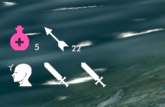

# SoulsyHUD basics

Soulsy lets you set hotkeys for managing what you have equipped or readied in four equipment slots:

- right hand: weapons, spells, two-handed weapons, scrolls
- left hand: one-handed weapons, spells, shields, torches, lanterns
- shouts and minor powers, scrolls
- a utility slot: potions, poisons, food, armor

Soulsy sets up _cycles_ for each of these equipment slots. For example, if you want to switch between Flames and Healing spells in your left hand, you'd add each of them to your left hand cycle. For your right hand, you might set up a long sword with an anti-undead enchantment, a dagger with Soul Trap, and a bow. Pressing the key assigned to a slot moves to the next item in your cycle and equips it (or readies it, in the case of the utility slot). If you tap the key several times quickly, you'll advance through the cycle and then equip the item you were on when you stopped tapping the button.

The maximum cycle length is configurable, but caps out at 20. 20 items is a lot of items to cycle through this way, and if you have that many you'd probably be better off using the inventory or favorites menu.

To add or remove an item from a cycle, bring up the inventory, magic or favorites menu, hover over the item, and press the hotkey for the cycle you want to change. If the item is not in the cycle for that slot and it's appropriate for the slot, it'll be added. If it's already in that cycle, it'll be removed. Soulsy prints text feedback on the screen about what it did.

Soulsy also has a hotkey for activating your selected utility item. This is the only category of item that Soulsy will try to activate for you; everything else needs to used the same way the base game has you use them. The last hotkey-able shortcut is for hiding and showing the HUD. There is an MCM setting if you want the HUD to fade out when you're not in combat or don't have your weapons readied.

That's it for the feature set. Soulsy does not (yet?) attempt to select the best ammo, potion or poison the way iEquip does. It equips what you tell it to equip, as quickly and reliably as it can. Soulsy also does not offer in-game layout editing, though you can modify the layout by editing a toml file outside the game. There's a refresh key that you can set and use to reload on the fly to
look at your changes.

## In-game options

TKTK: screenshot of MCM, explanation of defaults, etc

## Theming

Soulsy does not have any in-game way to edit the UI. However, almost everything about how it looks can be modified outside the game. Here's the mimimal layout I use in my own game:



You can modify your layout on the fly by editing values in `SoulsyHUD_Layout.toml`, saving the file, and pressing the refresh hotkey in-game. The HUD will update itself.

You can change all the background images and icons Soulsy uses. All images must be SVGs. Drop the files you'd  like to use into this file structure:

```text
SoulsyHUD/SKSE/plugins
├── resources
│  ├── animations/highlight/
│  ├── backgrounds/*
│  ├── buttons/*
│  ├── fonts/*
│  └── icons/*
└── SoulsyHUD_Layout.toml
```

- `SoulsyHud_Layout.toml` - The HUD layout, in TOML format. Set colors, transparencies, sizes, and locations for every HUD element.
- `backgrounds/hud_bg.svg` - The background for the entire HUD; SVG.
- `backgrounds/slot_bg.svg` - The background for a single cycle element (left hand, power, etc); SVG.
- `backgrounds/key_bg.svg` - The background for hotkey hints; SVG.
- `animations/highlight` - An animation to play on a highlighted slot. NOT YET FUNCTIONAL.
- `SKSE/plugins/resources/buttons` - Xbox and Playstation button art.
- `SKSE/plugins/resources/fonts` - TrueType fonts to use for display. The HUD comes with `futura-book-bt` to match Untarnished UI. Change the `font =` line in the layout file to point to a different font in this directory.
- `SKSE/plugins/resources/icons` - Icon files in SVG format, each named for the item. The HUD comes with the usual SkyUI icons.
