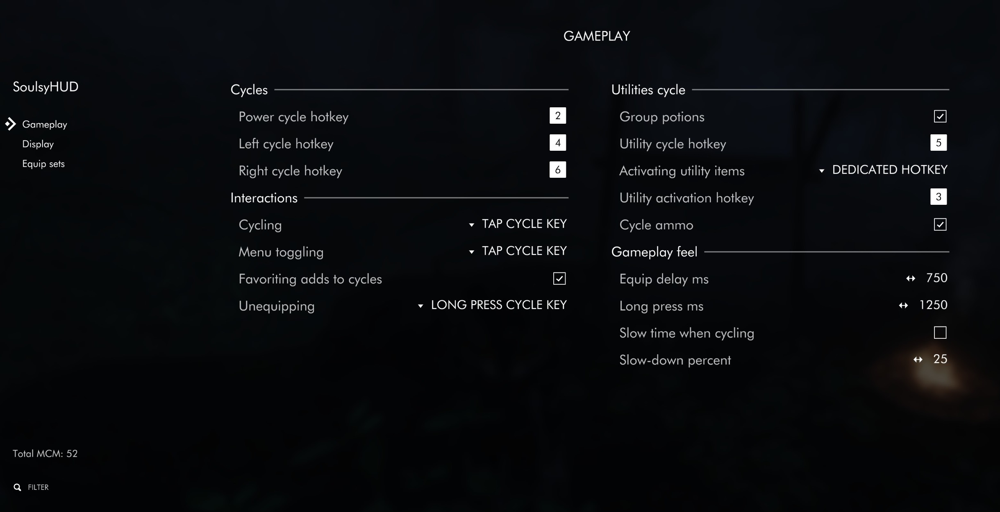
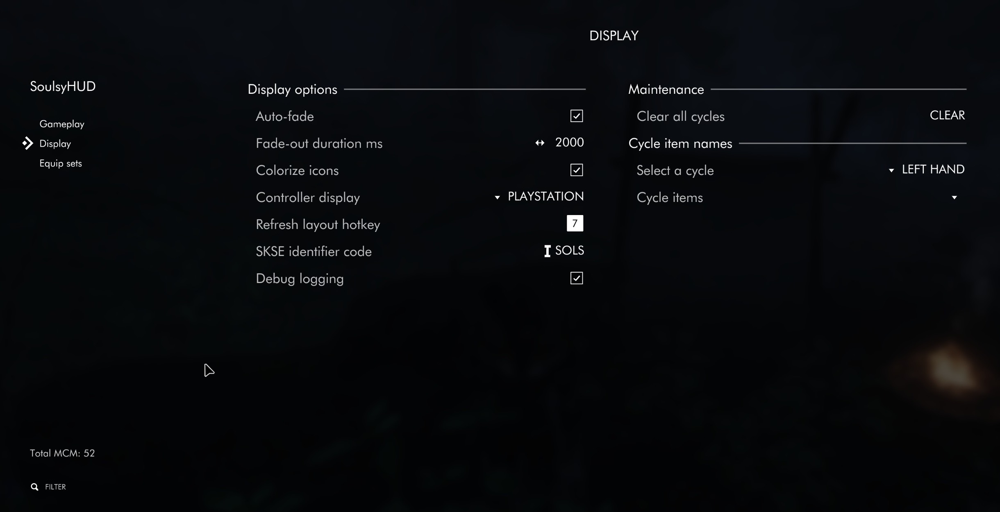
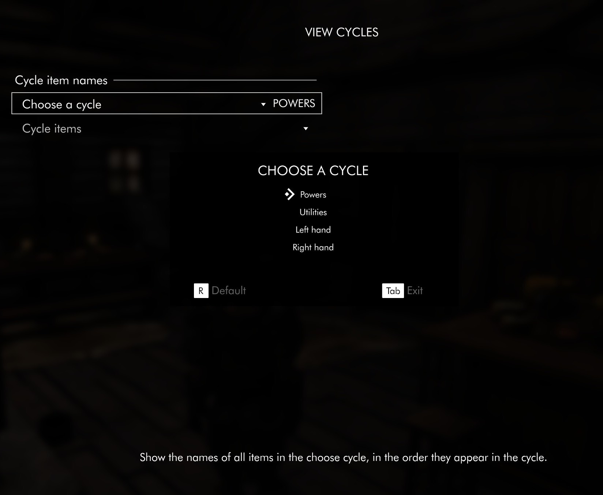
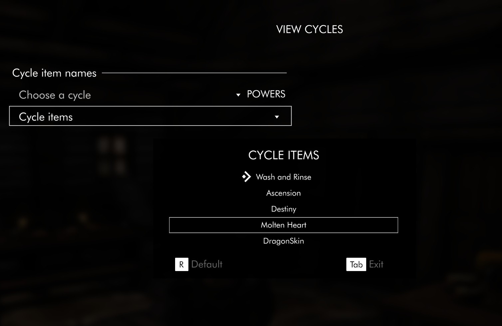

# Configuring the HUD

SoulsyHUD has gained a lot of configuration options since its first release. This article goes over each of them and makes suggestions for how to go about changing them.

Out of the box Soulsy is ready to use for keyboard and mouse users. You might want to change the keys bound to advancing cycles, but all the gameplay defaults are the way most people will want to use the HUD. In menus, hover over an item and tap a cycle key to add the item to the cycle. In regular gameplay, tap the cycle key to advance and equip another item. The HUD auto-fades when you're not in combat.

You can change how the keys work, the timing on fading and cycling, make cycling in combat slow time, and connect favorites to your cycles. Lots of other things can be tweaked if you want to customize it for your specific gameplay habits. Read on to learn more!

__Note:__ This article is [available on GitHub](https://github.com/ceejbot/soulsy/blob/latest/docs/article-options.md) with better formatting. You might find it easier to read there.

Table of contents:

1. [Configuring the HUD](#configuring-the-hud)
   1. [Before configuring](#before-configuring)
   2. [Hotkeys for cycling items](#hotkeys-for-cycling-items)
   3. [Adding and removing items](#adding-and-removing-items)
      1. [Favoriting](#favoriting)
      2. [Unarmed support](#unarmed-support)
      3. [Dual-wielding](#dual-wielding)
   4. [Utilities and consumables cycle](#utilities-and-consumables-cycle)
   5. [Gameplay feel](#gameplay-feel)
      1. [Equip delay](#equip-delay)
      2. [Long-press length](#long-press-length)
      3. [Slow-motion](#slow-motion)
   6. [Display options](#display-options)
   7. [Showing and hiding the HUD](#showing-and-hiding-the-hud)
      1. [Colorize icons](#colorize-icons)
      2. [Controller button display](#controller-button-display)
      3. [Refresh layout](#refresh-layout)
      4. [SKSE identifier code](#skse-identifier-code)
      5. [Debug logging](#debug-logging)
      6. [Clearing cycles](#clearing-cycles)
   8. [Equipment sets](#equipment-sets)
      1. [Creating equipment sets](#creating-equipment-sets)
      2. [Editing and updating sets](#editing-and-updating-sets)
      3. [Choosing an icon](#choosing-an-icon)

## Before configuring

If you are using a controller or intend to use some of the keys dedicated as hotkeys, you might want to unbind them first. The game doesn't show you any user interface for unbinding hotkeys, but you can do this with a *control map*. The Nexus has a number of control maps for PS and XBox controllers that set things up for you. One that works well is [Gamepad Controlmap for One Click Power Attack](https://www.nexusmods.com/skyrimspecialedition/mods/72417). If you want to make your own tweaks, I suggest you start with [this commented control map](https://www.nexusmods.com/skyrimspecialedition/mods/44160). A commented control map also comes with SoulsyHUD, which you can move into place and edit. (It has a name different from the required name so it doesn't change your controls on you by surprise.)

## Hotkeys for cycling items

At a minimum, you want to set hotkeys for the cycles. You need at least four: powers & shouts, left hand, right hand, and consumables. Pressing these keys let you change which item you have readied or equipped, and they allow you to add and remove items from the matching cycle. If you are using the equipment sets feature of SoulsyHUD, you'll need a fifth key for cycling through outfits or 'equip sets'. You cycle through equipment sets the same way you cycle through other times, but you create them differently. There's more information in the section on equipment sets.

Each of these cycles has three options for advancing it.

- A single tap of its hotkey or button. (the default)
- A long press of its button. (⚠️ This option might be removed in a future release!)
- A button press plus a modifier.

Modifiers are handy if you're using a controller and need to make each button do a lot of work. You might set up your d-pad to do long presses to advance a cycle, and short presses to do something else. Experiment to find out what works best for you!

## Adding and removing items

You add and remove items from cycles using the inventory and spell menus. Hover over the item you want to add or remove, and press your menu shortcut.

- Tap the hotkey for the cycle you want to toggle the item for. (the default)
- Long-press the cycle hotkey.
- A modifier plus the cycle hotkey.

SoulsyHUD displays a text message telling you whether the item was added or removed, or if it wasn't appropriate for that cycle.

### Favoriting

You can optionally tie cycles to *favorites*. Favorite an item to add it to the relevant cycle. Unfavorite to remove it. The HUD will make its best guess what what to do with weapons and spells you equip. If something is two-handed, it goes into the right hand. Single-handed spells go into both hands. If you have two or more of a one-handed weapon, it goes into both cycles so you can dual-wield. If the HUD guesses wrong, you can remove items from a cycle using the menu shortcuts.

### Unarmed support

The HUD can help you switch to unarmed combat, or unequip your hands or shout, if you do this often. You can choose one of these four options:

- Cycling to "Unarmed" entries for your left and right hands.
- Long-press on a cycle key unequips that slot. This works for shouts & powers.
- Modifier + cycle key unequips that slot. This also works for shouts & powers.
- No unarmed support. (the default)

If you select long-press here, you cannot long press to advance a cycle or to dual-wield. If you pick the modifier key, make sure it's different from any cycle advance modifier key.

### Dual-wielding

If you haven't already used long-press for cycling or for unequipping, you can enable a third option for using it: matching hands. You can long-press the left or right cycle key to dual-wield whatever is in that hand, if it can be dual-wielded. For example, if you have a spell in your right hand, you can long-press the right cycle key to equip the same spell in your left hand. Or if you have a dagger in your left hand, long-press left to equip the same kind of dagger in your right. This fails if you don't have at least two of the weapon in your inventory, or if it's a weapon or spell that can't go into either hand.

As a keyboard user, this is my preferred meaning for long-pressing a key. This feature is _disabled_ by default.

## Utilities and consumables cycle

The utilities cycle gives you fast access items you consume or use, like potions, poisons, food and drink, or armor. In addition to the cycle key for readying a utility item, SoulsyHUD lets you set up a shortcut for *activating* or using the item.

You have several choices for how you activate your readied utility item, similar to the ones for cycling. Your choices are:

- A hotkey of its own, which you single-tap. (the default)
- A long-press of the cycle hotkey.
- A modifier plus the cycle hotkey for utilities. For example, shoulder button + dpad-down.

You can also change how the HUD treats potion consumables. Enable *Group potions* to add one potion for each of health, magicka, and stamina to the utilities cycle. When you activate the single potion, the HUD will pick the best potion that will restore the stat without wasting too much. Leave this disabled if you'd prefer to manage choosing potions yourself. If you enable it, you'll see three grouped potions in the utilities cycle: Best Health, Best Magicka, and Best Stamina. All other health, magicka, and stamina potions will be removed from the utilities cycle so they don't clutter it up. (You can re-add them if you want to after you enable potion grouping.)

## Gameplay feel

The next section lets you control how the HUD feels during gameplay.

### Equip delay

SoulsyHUD does not equip items immediately as you change cycles, because the animations played while equipping might take time you'd rather not spend. Instead it starts a timer for a fraction of a second, and keeps the timer going while you're tapping a cycle key. When you stop tapping, the timer fires and the item is equipped. You can set how long the HUD waits for you to stop tapping. Very short times make the HUD feel snappier, but you might also equip items you don't want to. Very long times give you a chance to think as you go. Experiment with this to find out what time works for you.

The values here are in milliseconds. Delays from 500ms to 750ms work well for many players.

### Long-press length

You can tweak how long a press has to be before it qualifies as a long press. Soulsy will fire a long-press event immediately when this time elapses. This value is given in milliseconds. Experiment to find out what length feels best to you.

### Slow-motion

You can optionally turn on slo-mo mode for cycling while in combat. This slows the game down by the factor you select while you're trying to figure out which item you want to equip. The game returns to normal speed once you're done tapping buttons. This is another way on top of the equip delay to give yourself a little time to think about what you're equipping if you're in a stressful situation.

This option defaults to off, but many players will want to enable it. The default setting is to make time pass at 25% normal speed, or a 4x slowdown.

## Display options

## Showing and hiding the HUD

You have two choices here: whether you want to use a hotkey for toggling visibility, or whether you want the HUD to control its own visibility. If you choose auto-fade, the HUD will fade in when your weapons are drawn or you are in combat, and fade out otherwise. You can tweak the fade out time to your preference. The HUD always fades in *twice as fast* as it fades out.

The HUD will also always show itself briefly when you tap a cycle key, to give you visual feedback about what changed.

### Colorize icons

SoulsyHUD can draw icons using colors if you find colors useful. For example, it'll draw fire damage spells with a red color, frost damage spells with a blue color, and shock spells with a yellow color. It will also use any color keywords added to items by the [Object Categorization Framework](https://www.nexusmods.com/skyrimspecialedition/mods/81469) mod and any related mods you have installed. If you find color useful or pleasant to look at, enable this option. If you disable the option, all icons will be drawn with the color your layout requests, which is usually white.

### Controller button display

If you're using a controller to play, you can pick which kind of controller to show images for in the HUD's hotkeys display. All keyboard keys are shown with a generic hint, so keyboard-only users won't need to pick an option here.

### Refresh layout

Bind this hotkey to re-read the HUD layout file and apply any changes in it on the fly. You will uses this shortcut frequently if you're editing layouts often. See the article on [customizing layouts](https://www.nexusmods.com/skyrimspecialedition/articles/5633) to learn more about this workflow.

### SKSE identifier code

__⚠️ Do not change this option unless you have a specific reason to change it.__

Each SKSE mod that stores data in the cosave file must identify itself to the SKSE library using a unique 4-character identifier. However, nothing enforces uniqueness for these identifiers, so there's a chance that two mods might use the same four characters. The symptom would be failing to read or write plugin save data correctly. If you think this is happening to you—that is, if another mod is using `SOLS` as its identifier—you can change the one SoulsyHUD uses here.

*Changing this setting will wipe all saved cycle and equipment set data.* You must recreate your setup by hand if you want to use a new identifier. Most people will never need to touch this option.

### Debug logging

Enable this toggle and restart the game to make the mod log more verbosely.

All SKSE plugin mods log in the same directory: `Documents/my games/Skyrim Special Edition/SKSE`. SoulsyHUD writes two logs, one for its C++ code and one for its Rust code. (Interleaving log output from the two very different logging systems is more worth than it's worth.) The two log files are named `SoulsyHUD.log` and `SoulsyHUD_rust.log`.

In normal logging mode, SoulsyHUD's logs are designed for you to read to learn about what the mod is doing and how it's making decisions for you. At game load, it will log what all your cycles contain and what your equipment sets are, for example. In debug mode, the logs contain information intended to help the mod author debug. Enable this if you're curious or if you have a problem you're trying to figure out.

### Clearing cycles

The text is a button you can click on to wipe all of your cycles clear. (This does *not* affect equipment sets.) You cannot undo this action in-game. If you want your cycles back, you must load a save from before you cleared them.

##@ Previewing cycles

The second dropdown menu is filled in with the items in that cycle, in order.

## Equipment sets

If you want, you can use SoulsyHUD to cycle equipment sets, say, the way [Serio's Cycle Hotkeys](https://www.nexusmods.com/skyrimspecialedition/mods/27184) does. Equipment sets can include any item a player can equip that does not go into the left or right hands. (Behind the scenes, the code walks through all the available biped object slots and record what's in each.)

SoulsyHUD does not include any interface for editing items in equipment sets. The game already has a great user interface for choosing what you're wearing-- it's the SkyUI armor inventory screen!  Instead of trying to build an interface as good as that, SoulsyHUD records what the player character is wearing when an equipment set is created.

The workflow for making equipment sets is to put on exactly what you want to save as a set, and take off any items you don't want included in a set. Then go into the SoulsyHUD MCM and save a new equipment set.

This is the most complex MCM page in the mod, so we'll walk through all the available options now.

### Creating equipment sets

First you should set the key to use to advance equipment sets. This key works like all the other cycle keys and is affected by all the settings you've chosen for them, like modifiers and timers.

Toggle whether or not to unequip empty slots when you change sets. This option defaults to on. For example, if an equipment set does not a cloak or a backpack, should switching to that set unequip any cloak or backpack you're wearing or leave them on?

People use outfits in many ways while playing Skyrim. Some people might want to use an equipment set to swap in a fur cloak or other warm items during a survival playthrough, so they would turn this option off and use the sets as partial outfit switches. Other people want to use equipment sets as full outfits, such as swapping from a full set of armor to a set of clothing in-town for role-play reasons. People with that use case will leave the option on.

Next, we have a text field for the name to use for a new equipment set. The mod remembers what you typed in last time. Below that is

### Editing and updating sets

Select an equipment set from the dropdown. Below this is a text field containing the current name of the set you've selected.

- To rename the selected set, type in a new name.
- Next, press the `Rename set` text button.

The `Update set` text button updates the selected equipment set with what the player character is wearing right now.

The `Remove set` text button deletes the equipment set. You cannot undo this action.

### Choosing an icon

In the second column there's another dropdown menu. This dropdown shows all the items in the equipment set you've selected. You can use this dropdown to choose an icon to represent this equipment set in any layouts that draw icons for equipment sets.

1. Select an item in the equipment set from the dropdown.
2. Press the `Use this icon` text button to use that item's icon.

Icons are not previewed in the MCM for technical reasons. (The mod author would like to figure out a way to do this.)

## That's all the options!

The HUD has a lot more features than I ever anticipated it would have, but the players using it had requests for what they wanted it to do. The end result is better than the HUD I originally designed for myself, so thank you to everybody who ever asked for a feature or complained about something not working right. You made this mod good!
