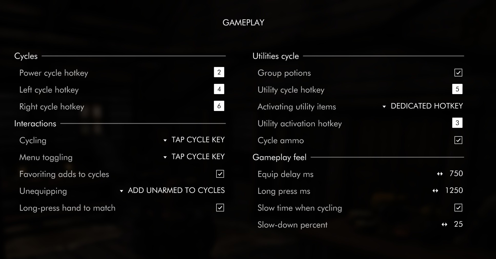

SoulsyHUD has gained a lot of configuration options since its first release. This article goes over each of them and makes suggestions for how to go about changing them.

Out of the box Soulsy is set up to work for keyboard and mouse users. You might want to change the keys bound to advancing cycles, but all the gameplay defaults are the way most people will want to use the HUD. In menus, hover over an item and tap a cycle key to add the item to the cycle. In regular gameplay, tap the cycle key to advance and equip another item. The HUD auto-fades when you're not in combat.

You can change how the keys work, the timing on fading and cycling, make cycling in combat slow time, and connect favorites to your cycles. Lots of other things can be tweaked if you want to customize it for your specific gameplay habits. Read on to learn more!

## Before configuring

If you are using a controller or intend to use some of the keys dedicated as hotkeys, you might want to unbind them first. The game doesn't show you any user interface for unbinding hotkeys, but you can do this with a *control map*. The Nexus has a number of control maps for PS and XBox controllers that set things up for you. One that works well is [Gamepad Controlmap for One Click Power Attack](https://www.nexusmods.com/skyrimspecialedition/mods/72417). If you want to make your own tweaks, I suggest you start with [this commented control map](https://www.nexusmods.com/skyrimspecialedition/mods/44160). One also comes with SoulsyHUD, which you can move into place and edit. (It has a name different from the required name so it doesn't change your controls on you by surprise.)

## Hotkeys for cycling items

At a minimum, you want to set hotkeys for the cycles. You need four: powers & shouts, left hand, right hand, and consumables. Pressing these keys let you change which item you have readied or equipped, and they allow you to add and remove items from the matching cycle.

Each of these cycles has three options for triggering it.

- A single tap of its hotkey or button. (the default)
- A long press of its button. (⚠️ This option might be removed in a future release!)
- A button press plus a modifier.

Long presses and modifiers are handy if you're using a controller and need to make each button do a lot of work. You might set up your d-pad to do long presses to advance a cycle, and short presses to do something else. The gamplay feel section of the options lets you set how long a long press is for you. Tweak this if the default doesn't feel right during gameplay.

## Adding and removing items

You add and remove items from cycles using the inventory and spell menus. Hover over the item you want to add or remove, and press your menu shortcut.

- Tap the hotkey for the cycle you want to toggle the item for. (the default)
- Long-press the cycle hotkey.
- A modifier plus the cycle hotkey.

SoulsyHUD displays a text message telling you whether the item was added or removed, or if it wasn't appropriate for that cycle.

### Favoriting

You can optionally tie cycles to *favorites*. Favorite an item to add it to the relevant cycle. Unfavorite to remove it. The HUD will make its best guess what what to do with weapons and spells you equip. If something is two-handed, it goes into the right hand. Single-handed spells go into both hands. If you have two or more of a one-handed weapon, you'll add it to both cycles so you can dual-wield. If the HUD guesses wrong, you can remove items from a cycle using the menu shortcuts.

### Unarmed support

The HUD can help you switch to unarmed combat, or unequip your hands or shout, if you do this often. You can choose one of these four options:

- Cycling to "Unarmed" entries for your left and right hands.
- Long-press on a cycle key unequips that slot. This works for shouts & powers.
- Modifier + cycle key unequips that slot. This also works for shouts & powers.
- No unarmed support. (the default)

If you select long-press here, you cannot long press to advance a cycle. If you pick the modifier key, make sure it's different from any cycle advance modifier key. As a keyboard user, I like long-press for this.

### Dual-wielding

If you haven't already used long-press for cycling or for unequipping, you can enable a third option for using it. You can long-press the left or right cycle key to dual-wield whatever is in that hand, if it can be dual-wielded. For example, if you have a spell in your right hand, you can long-press the right cycle key to equip the same spell in your left hand. Or if you have a dagger in your left hand, long-press left to equip the same kind of dagger in your right. This fails if you don't have at least two of the weapon in your inventory, or if it's a weapon or spell that can't go into either hand.

## Utilities and consumables cycle

You have several choices for how you *activate* your readied utility item, similar to the ones for cycling. Your choices are:

- A hotkey of its own, which you single-tap. (the default)
- A long-press of the cycle hotkey.
- A modifier plus the cycle hotkey for utilities. For example, shoulder button + dpad-down.

You can also change how the HUD treats potion consumables. Enable *Group potions* to add one potion for each of health, magicka, and stamina to the utilities cycle. When you activate the single potion, the HUD will pick the best potion that will restore the stat without wasting too much. Leave this disabled if you'd prefer to manage choosing potions yourself.

## Gameplay feel

### Equip delay

SoulsyHUD does not equip items immediately as you change cycles, because the animations played while equipping might take time you'd rather not spend. Instead it starts a timer for a fraction of a second, and keeps the timer going while you're tapping a cycle key. When you stop tapping, the timer fires and the item is equipped. You can set how long the HUD waits for you to stop tapping. Very short times make the HUD feel snappier, but you might also equip items you don't want to. Experiment with this to find out what time works for you.

The values here are in milliseconds. Delays from 500ms to 750ms work well for many players.

## Slow-motion

You can optionally turn on slo-mo mode for cycling while in combat. This slows the game down by the factor you select while you're trying to figure out which item you want to equip. The game returns to normal speed once you're done tapping buttons. This is another way on top of the equip delay to give yourself a little time to think about what you're equipping if you're in a stressful situation.

## Showing and hiding the HUD

You have two main choices here: whether you want to use a hotkey for toggling visibility, or whether you want the HUD to control its own visibility. If you choose auto-fade, the HUD will fade in when your weapons are drawn or you are in combat, and fade out when you're not. You can tweak the fade out time to your preference. The HUD always fades in twice as fast as it fades out.

## Controller button display

If you're using a controller to play, you can pick which kind of controller to show images for in the HUD's hotkeys display.

The behavior options you can set are whether it should fade out if you're not in combat (or don't have your weapons drawn), how long it takes to fade out, how many items you can have in a cycle, and how quickly it reacts to tapping a cycle key. Slowing down the equip delay makes the equipping an item take longer, but it gives you more time between taps. I recommend trying a half-second or a bit more for this setting.

All time delays are expressed in milliseconds, so you can get finicky here if you want to.

Soulsy offers you two ways to include unarmed combat in your cycles. First, there's an option to add unarmed directly to cycles, similar to the way iEquip handles it. Second, you can set a modifier key for switching to unarmed: press the modifier plus your left, right, or powers cycle key to unequip whatever you have equipped in that slot. 

You can also set a modifier key to require with the activate-utility key. This option allows you to set cycle utility and activate utility to the same button if you're short on buttons.

Finally, if you're really strapped, you can set up a modifier key required when you advance a cycle. For instance, if your D-pad keys are already in use, you could bind a shoulder key to this, then do shoulder + dpad to cycle.

## Previewing cycles

The second dropdown menu is filled in with the items in that cycle, in order.

